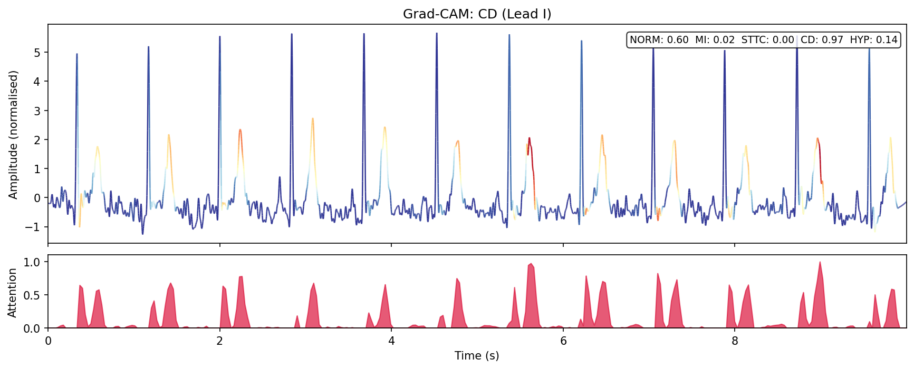

# HeartLens

AI ECG screening assistant that combines CNN-LSTM classification, Grad-CAM interpretability, and LLM-powered clinical explanation.


## Overview

HeartLens classifies cardiac abnormalities from 12-lead and single-lead ECG signals into five diagnostic superclasses (Normal, Myocardial Infarction, ST/T Change, Conduction Disturbance, Hypertrophy) using a residual CNN-LSTM with squeeze-and-excitation attention. Grad-CAM heatmaps highlight which waveform regions drive each prediction, and an LLM module translates the results into natural language clinical interpretations.

Key results on the PTB-XL benchmark (21,837 recordings):
- 12-lead macro AUC: 0.914 (mean over 3 seeds, 95% CI: 0.906--0.921)
- Single-lead (Lead I) macro AUC: 0.832
- Apple Watch validation: 96% normal-detection accuracy across 24 real recordings
- LLM comparison: GPT-5.4, Qwen3.5 (4B/2B/0.8B), and rule-based baseline evaluated across 34 synthetic scenarios in both text-only and multimodal modes

### Grad-CAM Example



Grad-CAM attention overlay for a conduction disturbance (CD) case. Red regions indicate where the model focuses. The attention concentrates on QRS complexes, consistent with how conduction abnormalities manifest in the ECG waveform.

## Setup

```bash
conda env create -f environment.yml
conda activate heartlens
```

For the LLM module, install Ollama on the inference machine and pull the model:

```bash
curl -fsSL https://ollama.com/install.sh | sh
ollama pull qwen3.5:4b
```

## Data

We use the [PTB-XL dataset](https://physionet.org/content/ptb-xl/) (Wagner et al., 2020). To download:

```bash
python data/download.py
```

The dataset is not included in this repository. Apple Watch ECG exports (CSV) can be placed in the `electrocardiograms/` directory for inference.

## Project Structure

```
HeartLens/
├── configs/            # Hyperparameter configs (YAML)
├── data/               # Dataset loading, preprocessing, augmentation
├── demo/               # Gradio interactive demo
├── evaluation/         # Metrics, Grad-CAM, LLM evaluation scripts
├── experiments/        # Training and ablation scripts
├── llm/                # LLM explanation module (API + rule-based)
├── models/             # CNN-LSTM, CNN-only, LSTM-only, CNN-Transformer
├── report/             # LaTeX report (TMLR format)
└── results/            # Saved models, figures, evaluation outputs
```

## Training

```bash
# Primary model (CNN-LSTM, 12-lead, 5 superclasses)
python experiments/train.py --config configs/default.yaml

# Single-lead variant
python experiments/train.py --config configs/default.yaml --single-lead

# Ablation models
bash experiments/run_ablation.sh

# Multi-seed evaluation
bash experiments/run_multi_seed.sh
```

## Evaluation

```bash
# Comprehensive metrics with bootstrap CIs
python evaluation/robust_eval.py --checkpoint results/best_model_cnn_lstm_superclass_12_lead.pt

# Grad-CAM visualisation
python evaluation/gradcam.py

# LLM comparison (text-only, 34 scenarios)
OPENAI_API_KEY=sk-... python evaluation/eval_llm_scaled.py

# Multimodal LLM evaluation (Grad-CAM image input)
OPENAI_API_KEY=sk-... python evaluation/eval_multimodal.py

# Apple Watch ECG analysis
python evaluation/apple_watch_test.py --ecg-dir electrocardiograms/
```

## Demo

```bash
python demo/app.py
```

Upload an Apple Watch ECG export (CSV) through the Gradio interface. The system classifies the recording, generates a Grad-CAM attention overlay, and produces an LLM explanation.

## Authors

Ziqi Ding, Zihan Ding, Ning Li, Estelle Liu, Patrick Zhu

Department of Electronic and Electrical Engineering, University College London

ELEC0149 Machine Learning, 2025/26
